<p align="center">
  
</p>

<p align="center">
  <strong>Create animated SVG terminal recordings from simple scripts and stdin</strong>
</p>

<p align="center">
  <a href="https://www.npmjs.com/package/dvd-cli"></a>
  <a href="https://www.npmjs.com/package/dvd-cli"></a>
  <a href="https://github.com/tool3/dvd/blob/master/LICENSE"></a>
</p>

<p align="center">
  <a href="#installation">Installation</a> •
  <a href="#quick-start">Quick Start</a> •
  <a href="#commands">Commands</a> •
  <a href="#settings">Settings</a> •
  <a href="#loop-styles">Loop Styles</a> •
  <a href="#examples">Examples</a>
</p>

---

<p align="center">
  
</p>

DVD generates animated SVG terminal recordings from declarative `.cd` scripts. Write what you want to happen, run `dvd`, and get a beautiful, infinitely scalable animation.

```
Output demo.svg

Set Theme tokyoNight
Set Template macos
Set Title "My Demo"

Type "echo 'Hello, World!'"
Enter
Sleep 2s
```

**No ffmpeg. No browser. No dependencies. Just SVG.**

## Installation

```bash
npm install -g dvd-cli
```

Or use directly with npx:

```bash
npx dvd-cli demo.cd
```

## Quick Start

### 1. Create a script

```bash
dvd new demo
```

This creates `demo.cd` with a starter template.

### 2. Edit your script

```
Output demo.svg

Set Template macos
Set Theme dracula
Set Title "My Terminal"

Type "echo 'Hello World!'"
Sleep 500ms
Enter
Sleep 1s
```

### 3. Render it

```bash
dvd demo.cd
```

### 4. Embed anywhere

```markdown

```

Your animated SVG works in GitHub READMEs, documentation sites, blogs - anywhere that supports images.

---

## Pipe Mode

Capture any command output directly:

```bash
# Capture a command's output
ls -la --color | dvd -o listing.svg

# Pipe animated output
lolcat -a -d 2 <<< "Hello World" | dvd -o rainbow.svg

# Capture neofetch
neofetch | dvd -o system-info.svg --title "System Info"
```

---

## Commands

### Type

Type text with realistic timing. Control speed with `@<ms>ms` suffix.

```
Type "echo 'Hello World'"
Type@100ms "Slow typing..."
Type@10ms "Speed typing!"
```

### Enter

Execute the current command.

```
Type "neofetch"
Enter
```



### Sleep

Pause the recording.

```
Sleep 500ms
Sleep 2s
```

### Backspace

Delete characters. Supports a count parameter.

```
Type "Hello Wrold"
Backspace 4
Type "orld!"
```


### Arrow Keys

Navigate with arrow keys. Supports a count parameter.

```
Left          # Move cursor left
Right         # Move cursor right
Left 5        # Move cursor left 5 times
Right 10      # Move cursor right 10 times
```

### Keyboard Shortcuts

Full keyboard navigation with selection support.

```
Shift+Left           # Select character left
Shift+Right          # Select character right
Alt+Left             # Move word left
Alt+Right            # Move word right
Alt+Shift+Left       # Select word left
Alt+Shift+Right      # Select word right
Cmd+Left             # Move to line start
Cmd+Right            # Move to line end
Cmd+Backspace        # Delete word
```


### Screenshot

Capture a static frame at any point.

```
Type "npm test"
Enter
Screenshot test-results.svg
```

---

## Settings

All settings use the `Set` command: `Set <Setting> <value>`

### Output

```
Output demo.svg
Output path/to/output.svg
```

### Theme

```
Set Theme dracula
```

**Available themes (37):** `a11yDark`, `base16Dark`, `base16Light`, `blackboard`, `catppuccinMocha`, `cobalt`, `dark`, `dracula`, `draculaPro`, `duotoneDark`, `githubDark`, `githubLight`, `gruvboxDark`, `gruvboxLight`, `hopscotch`, `lucario`, `material`, `monokai`, `night3024`, `nord`, `oceanicNext`, `oneDark`, `oneLight`, `pandaSyntax`, `paraisoDark`, `seti`, `shadesOfPurple`, `solarizedDark`, `solarizedLight`, `synthwave84`, `terminal`, `tokyoNight`, `twilight`, `verminal`, `vscode`, `yeti`, `zenburn`


### Template

Window chrome style.

```
Set Template macos     # macOS traffic lights
Set Template windows   # Windows-style buttons
Set Template minimal   # No window decorations
```

<table>
<tr>
<td><strong>macOS</strong></td>
<td><strong>Windows</strong></td>
</tr>
<tr>
<td></td>
<td></td>
</tr>
</table>

### Title

```
Set Title "My Terminal"
```

### Dimensions

Omit for auto-sizing based on content.

```
Set Width 800
Set Height 600
```

### Font

```
# System font (viewer must have it installed)
Set FontFamily "Fira Code"
Set FontSize 14
Set LineHeight 1.4

# Embedded font (guaranteed to render correctly)
Set EmbedFont path/to/font.woff2
```


### Cursor

```
Set CursorStyle block      # block, bar, underline
Set CursorColor #ffffff
Set CursorBlink true
```


### Typing Speed

Default milliseconds per character.

```
Set TypingSpeed 50
```

### Prompt

Supports ANSI escape codes for colors.

```
Set PromptPrefix "$ "
Set PromptPrefix "❯ "
Set PromptPrefix "\x1b[95m❯\x1b[0m "    # Colored prompt
```


### Border

```
Set BorderRadius 8
Set BorderWidth 2
Set BorderColor #ff0000
```


### Padding

```
Set Padding 16
```

### Header & Footer

```
Set HeaderHeight 40
Set HeaderBackground #333333
Set HeaderBorder true
Set HeaderBorderColor #444444
Set HeaderBorderWidth 1

Set FooterHeight 30
Set FooterBackground #333333
Set FooterBorder true
```


### Watermark

```
Set Watermark "Made with DVD"
Set WatermarkStyle "opacity: 0.5; padding: 10"
```

For SVG markup watermarks (e.g., clickable links):

```
Set Watermark `<a href="https://github.com/tool3/dvd">
  <text text-anchor="end">DVD</text>
</a>`
```

### Shell

Set the shell for executing commands.

```
Set Shell /bin/zsh
Set Shell /bin/bash
```

---

## Loop Styles

Control how animations behave when they reach the end.

### Default Loop

Animation restarts from the beginning.

```
Set LoopStyle loop
```

### Reverse

Animation plays forward, then backward at the same speed.

```
Set LoopStyle reverse
```



### Rewind

Fast reverse playback - like rewinding a tape.

```
Set LoopStyle rewind
Set RewindSpeed 10       # Speed multiplier (default: 5)
```



### Fade

Fade to black before restarting.

```
Set LoopStyle fade
Set FadeDuration 1500    # Fade duration in ms (default: 1500)
```



### Loop Pause

Add a pause between animation cycles.

```
Set LoopPause 2000       # Pause 2 seconds before restarting
```

---

## CLI Options

```bash
# Basic usage
dvd script.cd                          # Render to script.svg
dvd script.cd -o output.svg            # Custom output path
dvd script.cd --verbose                # Show detailed output

# Loop styles
dvd script.cd --loop-style reverse     # Reverse animation
dvd script.cd --loop-style rewind      # Fast rewind
dvd script.cd --loop-style fade        # Fade to black
dvd script.cd --rewind-speed 10        # Rewind speed multiplier
dvd script.cd --fade-duration 2000     # Fade duration (ms)
dvd script.cd --loop-pause 1500        # Pause between loops (ms)

# Animation control
dvd script.cd --no-loop                # Play once, don't loop
dvd script.cd --pause-at-end 2000      # Pause at end before looping

# Styling (override script settings)
dvd script.cd --theme dracula
dvd script.cd --template macos
dvd script.cd --title "My Demo"
dvd script.cd --font-size 16
dvd script.cd --cursor-style bar

# Dimensions
dvd script.cd --width 800 --height 600

# Pipe mode
command | dvd -o output.svg
ls -la | dvd -o listing.svg --theme nord

# Utilities
dvd new my-demo                        # Create new script
dvd new my-demo --template showcase    # Use template
dvd themes                             # List themes
dvd validate script.cd                 # Validate without rendering
```

### All CLI Options

| Option | Alias | Description | Default |
|--------|-------|-------------|---------|
| `--output` | `-o` | Output file path | `<input>.svg` |
| `--verbose` | `-v` | Show detailed output | `false` |
| `--loop` | `-l` | Loop the animation | `true` |
| `--loop-style` | `-L` | Loop style: `loop`, `reverse`, `rewind`, `fade` | `loop` |
| `--loop-pause` | | Pause before loop restarts (ms) | `0` |
| `--pause-at-end` | `-p` | Pause at end before looping (ms) | `1000` |
| `--fade-duration` | | Fade duration for fade style (ms) | `1500` |
| `--rewind-speed` | | Speed multiplier for rewind | `5` |
| `--theme` | `-T` | Color theme | `dark` |
| `--template` | | Window style: `macos`, `windows`, `minimal` | `macos` |
| `--title` | `-t` | Window title | |
| `--width` | `-W` | Width in pixels | auto |
| `--height` | `-H` | Height in pixels | auto |
| `--font-size` | | Font size in pixels | `14` |
| `--font-family` | | Font family name | |
| `--line-height` | | Line height multiplier | `1.4` |
| `--padding` | | Content padding (px) | `16` |
| `--border-radius` | | Border radius (px) | `8` |
| `--border-color` | | Border color (hex) | |
| `--border-width` | | Border width (px) | |
| `--cursor-style` | | `block`, `bar`, `underline` | `block` |
| `--cursor-color` | | Cursor color (hex) | |
| `--cursor-blink` | | Enable cursor blink | `true` |
| `--watermark` | | Watermark text | |

---

## Examples

### Hello World


### ANSI Colors

Full 256-color and truecolor support.


### ASCII Art with Figlet


### Charts with Chartscii


### Rainbow Animation

Animated command output is captured frame-by-frame.


### Git Log


### System Info


### Text Selection


### Word Navigation


### Color Tables


### Directory Listing


See the [examples/](examples/) directory for all scripts and outputs.

---

## Why DVD?

| | DVD | VHS | asciinema |
|---|:---:|:---:|:---:|
| **Output** | SVG | GIF/MP4 | asciicast |
| **Dependencies** | None | ffmpeg, ttyd | Player embed |
| **File size** | Small | Large | Small |
| **Scalable** | Yes | No | Yes |
| **GitHub README** | Perfect | Works | Embed only |
| **Editable** | Yes (XML) | No | Yes (JSON) |
| **Offline** | Yes | Yes | No |
| **Print quality** | Yes | No | No |
| **Loop styles** | 4 modes | Basic | Basic |

---

## Related Projects

- [VHS](https://github.com/charmbracelet/vhs) - GIF/MP4 terminal recordings
- [shellfie](https://github.com/tool3/shellfie) - Terminal screenshots in code
- [shellfie-cli](https://github.com/tool3/shellfie-cli) - Terminal screenshots CLI
- [shellfied](https://github.com/tool3/shellfied) - Terminal screenshots web service

---

## License

MIT © [tool3](https://github.com/tool3)
