# DVD - Cinema Display for Terminal Recordings

Create beautiful animated SVG terminal recordings from `.cd` scripts.

```text
# Where should we output the SVG?
Output demo.svg

Set Template minimal
Set FontSize 46
Set BorderRadius 10

# Type a command in the terminal.
Type "echo 'Welcome to DVD!'"

# Pause for dramatic effect...
Sleep 500ms

# Run the command by pressing enter.
Enter

# Admire the output for a bit.
Sleep 5s
```

Inspired by [VHS](https://github.com/charmbracelet/vhs), dvd generates pure SVG animations without requiring ffmpeg, ttyd, or a browser. Perfect for documentation, demos, and showcasing CLI tools in GitHub READMEs.

## Features

- 🎬 **Pure SVG animations** - No video encoding, just CSS keyframes
- 🚀 **Zero external dependencies** - No ffmpeg, ttyd, or Chromium required
- 📝 **VHS-inspired syntax** - Familiar declarative scripting format
- 🎨 **13 built-in themes** - Dracula, Nord, Tokyo Night, and more
- ⌨️ **Keyboard navigation** - Full support for text selection, word movement, shortcuts
- 📸 **Screenshots** - Capture static frames during animation
- 🔧 **Customizable** - Fonts, dimensions, themes, templates

## Installation

```bash
npm install -g dvd-cli
```

## Quick Start

Create a new script:

```bash
dvd new demo
```

This creates `demo.cd`:

```
# Basic CD Script
Output demo.svg

Set Title "My Terminal Demo"
Set Theme dracula
Set Width 800
Set Height 600

Type "echo 'Hello, Cinema Display!'"
Enter
Sleep 1s
```

Render it to SVG:

```bash
dvd demo.cd
```

## Commands

### dvd [file]

Render a `.cd` script to animated SVG (default command).

```bash
dvd script.cd
dvd script.cd -o output.svg
dvd script.cd --verbose
dvd script.cd --no-loop
```

**Options:**

- `-o, --output <path>` - Output SVG file path
- `-v, --verbose` - Show detailed progress
- `-l, --loop` - Loop animation (default: true)
- `-p, --pause-at-end <ms>` - Pause duration at end (default: 1000)
- `-f, --fps <number>` - Frames per second

### dvd new [name]

Create a new `.cd` script from a template.

```bash
dvd new my-demo
dvd new showcase --template showcase
dvd new keyboard --template keyboard
```

**Templates:**

- `basic` - Simple demo (default)
- `showcase` - Feature showcase with screenshots
- `keyboard` - Keyboard navigation demo

### dvd themes

List all available themes.

```bash
dvd themes
```

### dvd validate <file>

Validate a `.cd` script.

```bash
dvd validate script.cd
```

## .cd Format

See [FORMAT.md](FORMAT.md) for complete specification.

### Basic Commands

```
# Output
Output demo.svg

# Basic settings
Set Width 800
Set Height 600
Set FontSize 16
Set Theme dracula
Set Title "My Demo"
Set TypingSpeed 50

# Input simulation
Type "echo 'Hello World'"
Enter
Backspace 5
Space
Tab

# Arrow keys
Left
Right
Up
Down

# Keyboard shortcuts
Shift+Left
Shift+Right
Alt+Left
Alt+Right
Cmd+Left
Cmd+Right
Cmd+Backspace

# Timing
Sleep 1s
Sleep 500ms

# Utilities
Screenshot frame.svg
```

## Set Commands Reference

All available `Set` commands for configuring your terminal recording:

### Dimensions & Layout

| Command             | Description                                                       | Default |
| ------------------- | ----------------------------------------------------------------- | ------- |
| `Set Width <px>`    | Terminal width in pixels. Omit for auto-width based on content.   | auto    |
| `Set Height <px>`   | Terminal height in pixels. Omit for auto-height based on content. | auto    |
| `Set FontSize <px>` | Font size in pixels                                               | 14      |
| `Set Padding <px>`  | Content padding in pixels                                         | 16      |

### Font

| Command                 | Description                                      | Default               |
| ----------------------- | ------------------------------------------------ | --------------------- |
| `Set FontFamily <name>` | Font family name (system font or web font)       | SF Mono, Monaco, etc. |
| `Set EmbedFont <path>`  | Embed a font file (woff2, ttf, otf) into the SVG | none                  |

**Embedding fonts** ensures your SVG looks the same everywhere, even if the viewer doesn't have the font installed:

```
# Use a system font (viewer must have it installed)
Set FontFamily "Fira Code"

# Or embed a font file directly into the SVG (recommended)
Set EmbedFont examples/fonts/JetBrainsMono-Regular.woff2
```

Pre-packaged fonts in `examples/fonts/`:

- `JetBrainsMono-Regular.woff2` - Popular coding font with ligatures
- `FiraCode-Regular.woff2` - Another great coding font with ligatures
- `SourceCodePro-Regular.woff2` - Adobe's clean monospace font
- `IBMPlexMono-Regular.woff2` - IBM's modern monospace font
- `RobotoMono-Regular.woff2` - Google's Roboto in monospace
- `UbuntuMono-Regular.woff2` - Ubuntu's distinctive monospace font

### Appearance

| Command                   | Description                                                   | Default |
| ------------------------- | ------------------------------------------------------------- | ------- |
| `Set Theme <name>`        | Color theme (see Themes section)                              | dark    |
| `Set Template <name>`     | Window template: `macos`, `windows`, `minimal`                | minimal |
| `Set Title <text>`        | Window title (shown in title bar for macos/windows templates) | none    |
| `Set Watermark <text>`    | Watermark text (bottom-right, supports ANSI)                  | none    |
| `Set PromptPrefix <text>` | Custom shell prompt prefix (supports ANSI)                    | `❯ `    |

### Border & Corners

| Command                   | Description               | Default           |
| ------------------------- | ------------------------- | ----------------- |
| `Set BorderRadius <px>`   | Window corner radius      | 8 (0 for minimal) |
| `Set BorderWidth <px>`    | Window border width       | 0                 |
| `Set BorderColor <color>` | Window border color (hex) | theme foreground  |

### Header Configuration

| Command                         | Description                   | Default            |
| ------------------------------- | ----------------------------- | ------------------ |
| `Set HeaderBackground <color>`  | Header background color (hex) | theme background   |
| `Set HeaderHeight <px>`         | Header height in pixels       | 40 (0 for minimal) |
| `Set HeaderBorder <bool>`       | Show border line below header | false              |
| `Set HeaderBorderColor <color>` | Header border line color      | theme foreground   |
| `Set HeaderBorderWidth <px>`    | Header border line width      | 1                  |

### Footer Configuration

| Command                         | Description                   | Default          |
| ------------------------------- | ----------------------------- | ---------------- |
| `Set FooterBackground <color>`  | Footer background color (hex) | none             |
| `Set FooterHeight <px>`         | Footer height in pixels       | 0                |
| `Set FooterBorder <bool>`       | Show border line above footer | false            |
| `Set FooterBorderColor <color>` | Footer border line color      | theme foreground |
| `Set FooterBorderWidth <px>`    | Footer border line width      | 1                |

### Cursor

| Command                   | Description                               | Default      |
| ------------------------- | ----------------------------------------- | ------------ |
| `Set CursorStyle <style>` | Cursor shape: `block`, `bar`, `underline` | block        |
| `Set CursorColor <color>` | Cursor color (hex)                        | theme cursor |
| `Set CursorBlink <bool>`  | Enable cursor blinking                    | true         |

### Behavior

| Command                   | Description                                         | Default |
| ------------------------- | --------------------------------------------------- | ------- |
| `Set TypingSpeed <ms>`    | Milliseconds per character when typing              | 50      |
| `Set AnimationSpeed <ms>` | Milliseconds between frames for animated output     | 50      |
| `Set Scroll <bool>`       | Enable scrolling when content exceeds height        | auto    |

**Animated Output:** Commands that produce animated terminal output (like `lolcat -fa`) are automatically detected and each animation frame is captured. Use `AnimationSpeed` to control the timing between frames in the final SVG.

### Auto-sizing

When you omit `Set Width` or `Set Height`, dvd automatically calculates dimensions:

```
# Auto width and height based on content
Set FontSize 16
Set Title "Auto-sized"
Type "Content determines size"
```

```
# Fixed height, auto width
Set Height 400
Type "Width auto-calculated"
```

```
# Fixed width, auto height (content can scroll)
Set Width 600
Type "Height auto-calculated"
```

## Themes

Available themes:

- catppuccinMocha
- dracula
- githubDark
- githubLight
- gruvboxDark
- gruvboxLight
- monokai
- nord
- oneDark
- solarizedDark
- solarizedLight
- tokyoNight
- terminal

## Templates

Available templates:

- **minimal** - Clean, minimal design (default)
- **macos** - macOS-style terminal with traffic light buttons
- **windows** - Windows terminal style

## Related

- [shellfie](https://github.com/tool3/shellfie) - The core library for static terminal screenshots
- [shellfie-cli](https://github.com/tool3/shellfie-cli) - CLI for static SVG generation from terminal output
- [VHS](https://github.com/charmbracelet/vhs) - Similar tool that generates GIF/MP4 terminal recordings

## Why dvd?
Unlike VHS which uses a browser and ffmpeg to generate video files, dvd:

- Generates pure SVG with CSS animations (scalable, lightweight)
- Runs anywhere without external dependencies
- Produces smaller files (SVG vs GIF/MP4)
- Works perfectly in GitHub READMEs

## Examples

See the [examples/](examples/) directory for complete working examples.

### ANSI Colors
Demonstration of all ANSI color codes and styles.

### ASCII Art
ASCII art rendering using echo with escape sequences.

### Backspace
Testing backspace functionality with watermark.

### Border Test
Custom border styling with radius and colors.

### Chartscii
ASCII chart rendering with chartscii-cli.

### Colors Table
Full 256 color palette demonstration.

### Cursor Blink
Animated cursor blinking effect.

### Cursor Styles
Different cursor styles: block, bar, and underline.

### Cursor Test
Cursor alignment testing.


### Custom Font
Using custom fonts with font embedding.

### Custom Prompt
Custom shell prompt prefix with ANSI styling.

### Embed Font Test
Font embedding with JetBrains Mono for consistent rendering.

### Embedded Font
Font embedded directly into the SVG for offline viewing.

### Figlet
Figlet ASCII art with isometric font and lolcat colors.


### Font Sizes
Different font size configurations.

### Git Log
Git log with graph, colors, and decorations.

### Header and Footer
Custom header and footer styling.

### Htop-like
System stats with top and df commands.

### Keyboard Navigation
Text selection, word movement, and keyboard shortcuts.

### Lolcat Animation
Animated rainbow text with lolcat -fa.

### LS Colors
Colored file listings with ls command.

### macOS Style
macOS terminal window with traffic light buttons.

### Multiline
Multi-line Type command using backticks with ASCII art.

### Neofetch Auto Height
Neofetch with automatic height calculation.

### Neofetch Embedded Font
Neofetch with JetBrains Mono font embedded.

### Neofetch Fixed Dimensions
Neofetch with explicit width and height.

### Neofetch Theme and Cursor
Neofetch with Dracula theme and custom underline cursor.

### Nord Theme
Nord color theme demonstration.

### Rainbow
Rainbow text effects.

### Rainbow Lolcat
Rainbow gradient colors with lolcat.

### Scroll Test
Terminal scrolling behavior.

### Selection Test
Text selection highlighting.

### Slow Typing
Slow typing speed demonstration.

### Templates
Different window templates (minimal, macos, windows).

### Theme Test
Theme configuration showcase.

### Underline Cursor
Underline cursor style.

### Windows Style
Windows terminal window style.

### Word Deletion
Word deletion with keyboard shortcuts.


### Word Navigation
Word-by-word navigation with Alt+Arrow keys.


### Word Selection
Word selection with Shift+Alt+Arrow keys.


## License

MIT

## Author

tool3
