# DVD

<p align="center">
  
</p>

<p align="center">
  <strong>Create animated SVG terminal recordings from simple scripts</strong>
</p>

<p align="center">
  <a href="#installation">Installation</a> •
  <a href="#quick-start">Quick Start</a> •
  <a href="#commands">Commands</a> •
  <a href="#settings">Settings</a> •
  <a href="#examples">Examples</a>
</p>

---

DVD generates animated SVG terminal recordings from declarative scripts. Write what you want to happen, run `dvd`, and get a beautiful, scalable animation.

```
Output demo.svg

Set Theme dracula
Set Template macos
Set Title "My Demo"

Type "echo 'Hello, World!'"
Enter
Sleep 2s
```

**No ffmpeg. No browser. No dependencies. Just SVG.**

## Installation

```bash
npm install -g dvd-cli
```

## Quick Start

```bash
# Create a new script
dvd new demo

# Edit it to your liking, then render
dvd demo.cd
```

Your animated SVG is ready to embed anywhere:

```markdown

```

## Commands

### Type

Type text with realistic timing. Control speed with `@<ms>ms` suffix.

```
Type "echo 'Hello World'"
Type@100ms "Slow typing..."
Type@10ms "Speed typing!"
```


### Enter

Execute the current command.

```
Type "neofetch"
Enter
```


### Sleep

Pause the recording.

```
Sleep 500ms
Sleep 2s
```

### Backspace

Delete characters. Supports a count parameter.

```
Type "Hello Wrold"
Backspace 4
Type "orld!"
```


### Arrow Keys

Navigate with arrow keys. Supports a count parameter.

```
Left          # Move cursor left
Right         # Move cursor right
Left 5        # Move cursor left 5 times
Right 10      # Move cursor right 10 times
```

### Keyboard Shortcuts

Full keyboard navigation with selection support. All shortcuts support a count parameter.

```
Shift+Left           # Select character left
Shift+Right          # Select character right
Shift+Left 5         # Select 5 characters left
Alt+Left             # Move word left
Alt+Right            # Move word right
Alt+Shift+Left       # Select word left
Alt+Shift+Right      # Select word right
Cmd+Left             # Move to line start
Cmd+Right            # Move to line end
Cmd+Backspace        # Delete word
```


### Screenshot

Capture a static frame at any point.

```
Type "npm test"
Enter
Screenshot test-results.svg
```

## Settings

### Output

Set the output file path.

```
Output demo.svg
```

### Theme

Set the color theme.

```
Set Theme dracula
```

**Available themes (37):** `a11yDark`, `base16Dark`, `base16Light`, `blackboard`, `catppuccinMocha`, `cobalt`, `dark`, `dracula`, `draculaPro`, `duotoneDark`, `githubDark`, `githubLight`, `gruvboxDark`, `gruvboxLight`, `hopscotch`, `lucario`, `material`, `monokai`, `night3024`, `nord`, `oceanicNext`, `oneDark`, `oneLight`, `pandaSyntax`, `paraisoDark`, `seti`, `shadesOfPurple`, `solarizedDark`, `solarizedLight`, `synthwave84`, `terminal`, `tokyoNight`, `twilight`, `verminal`, `vscode`, `yeti`, `zenburn`


### Template

Set the window chrome style.

```
Set Template macos     # macOS traffic lights
Set Template windows   # Windows-style buttons
Set Template minimal   # No decorations (default)
```

<table>
<tr>
<td><strong>macOS</strong></td>
<td><strong>Windows</strong></td>
</tr>
<tr>
<td></td>
<td></td>
</tr>
</table>

### Dimensions

Set terminal size. Omit for auto-sizing based on content.

```
Set Width 800
Set Height 600
```

### Font

Set font family or embed a custom font for guaranteed rendering.

```
# System font (viewer must have it)
Set FontFamily "Fira Code"

# Embedded font (always works)
Set EmbedFont path/to/font.woff2
```


### Title

Set the window title (shown with macos/windows templates).

```
Set Title "My Terminal"
```

### Cursor

Customize cursor appearance.

```
Set CursorStyle block      # block, bar, underline
Set CursorColor #ffffff
Set CursorBlink true
```


### Typing Speed

Control default typing speed in milliseconds per character.

```
Set TypingSpeed 50
```

### Prompt

Customize the shell prompt. Supports ANSI escape codes.

```
Set PromptPrefix "$ "
Set PromptPrefix "❯ "
Set PromptPrefix "\x1b[95m❯\x1b[0m "    # Colored prompt
```


### Border

Style the window border.

```
Set BorderRadius 8
Set BorderWidth 2
Set BorderColor #ff0000
```


### Header & Footer

Customize header and footer sections.

```
Set HeaderHeight 40
Set HeaderBackground #333333
Set HeaderBorder true

Set FooterHeight 30
Set FooterBackground #333333
Set FooterBorder true
```


### Watermark

Add a watermark in the corner with optional styling.

```
Set Watermark "Made with DVD"
Set WatermarkStyle "opacity: 0.5; padding: 10"
```

For SVG markup watermarks (e.g., clickable links), use backticks for multiline content:

```
Set Watermark `<a href="https://github.com">
  <text text-anchor="end">GitHub</text>
</a>`
```

## CLI Options

```bash
# Render a script
dvd script.cd
dvd script.cd -o output.svg
dvd script.cd --verbose

# Animation options
dvd script.cd --no-loop
dvd script.cd --pause-at-end 2000

# Create new script
dvd new myproject
dvd new myproject --template showcase

# Utilities
dvd themes              # List available themes
dvd validate script.cd  # Validate without rendering
```

## Examples

### Demo

A simple hello world animation.



### ANSI Colors

Full ANSI color support with 256 colors and truecolor.


### ASCII Art with Figlet


### Charts with Chartscii


### Rainbow Animation

Commands with animated output are automatically captured frame-by-frame.


### Git Log


### System Info


### Emoji Support

Full emoji support including skin tones and ZWJ sequences.



### Text Selection

Interactive text selection and editing.


### Word Navigation


### Multiple Font Sizes


### Color Tables


### Directory Listing


See the [examples/](examples/) directory for all scripts and outputs.

## Why DVD?

| | DVD | VHS | asciinema |
|---|:---:|:---:|:---:|
| **Output** | SVG | GIF/MP4 | asciicast |
| **Dependencies** | None | ffmpeg, ttyd | Player embed |
| **File size** | Small | Large | Small |
| **Scalable** | ✓ | ✗ | ✓ |
| **GitHub README** | Perfect | Works | Embed only |
| **Editable** | ✓ (XML) | ✗ | ✓ (JSON) |
| **Offline** | ✓ | ✓ | ✗ |
| **Print quality** | ✓ | ✗ | ✗ |

## Related Projects

- [VHS](https://github.com/charmbracelet/vhs) - GIF/MP4 terminal recordings
- [shellfie](https://github.com/tool3/shellfie) - shellfie in code
- [shellfie-cli](https://github.com/tool3/shellfie-cli) - shellfie in commandl line
- [shellfied](https://github.com/tool3/shellfied) - shellfie in the web

## License

MIT
