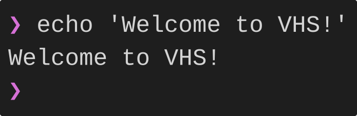

<p align="center">
  
</p>

<h1 align="center">DVD</h1>

<p align="center">
  <strong>Animated SVG terminal recordings.</strong><br>
  Write a script, run <code>dvd</code>, get an infinitely-scalable animation you can drop in any README.
</p>

<p align="center">
  <a href="https://www.npmjs.com/package/dvdrw-cli"></a>
  <a href="https://www.npmjs.com/package/dvdrw-cli"></a>
  <a href="https://github.com/tool3/dvd-cli/blob/master/LICENSE.md"></a>
  =18">
</p>

<p align="center">
  <a href="#quick-start">Quick start</a> ·
  <a href="#why-svg">Why SVG</a> ·
  <a href="#three-ways-to-record">Recording</a> ·
  <a href="#syntax-reference">Syntax</a> ·
  <a href="#themes">Themes</a> ·
  <a href="#cli-reference">CLI</a> ·
  <a href="#faq">FAQ</a>
</p>

---

## What you get

DVD turns terminal output into a **single self-contained animated SVG**. No ffmpeg. No headless browser. No video encoder.

Because the output is SVG, it is *text*: the frames are real glyphs, so the result stays sharp at any zoom, weighs almost nothing on the wire, and can be edited, diffed, and version-controlled like source.

```bash
npx dvdrw-cli demo.cd
```


---

## Quick start

### Install

<table>
<tr><td><strong>Homebrew</strong></td><td>

```sh
brew install tool3/tap/dvd
```

</td></tr>
<tr><td><strong>Shell</strong></td><td>

```sh
curl -fsSL https://raw.githubusercontent.com/tool3/dvd-cli/master/scripts/install.sh | bash
```

</td></tr>
<tr><td><strong>npm</strong></td><td>

```sh
npm install -g dvdrw-cli     # global
npx dvdrw-cli --help         # no install
npm install -D dvdrw-cli     # per-project
```

</td></tr>
</table>

> The npm package is **`dvdrw-cli`**; the binary it installs is **`dvd`**.
> With `npx` you must use the full package name: `npx dvdrw-cli`.

### Your first recording

```bash
dvd new demo
```

That scaffolds `demo.cd`:

```
Output demo.svg

Set Template macos
Set Theme dracula
Set Title "My Terminal"

Type "echo 'Hello World!'"
Sleep 500ms
Enter
Sleep 1s
```

Render it:

```bash
dvd demo.cd
```

Then embed it anywhere that takes an image:

```markdown

```

---

## Why SVG

An honest comparison — including where DVD is the wrong tool.

|                                   |         DVD            |       VHS        |        asciinema         |
| --------------------------------- | :--------------------: | :--------------: | :----------------------: |
| **Output**                        | animated SVG + MP4/WebM/GIF | GIF / MP4 / WebM |    `.cast` + player      |
| **External binaries to render**   | none for SVG, ffmpeg for video | ffmpeg, ttyd |          none            |
| **Resolution-independent**        |       yes (SVG)        |       no         |          yes             |
| **Text is real text**             |       yes (SVG)        |       no         |          yes             |
| **Works as a plain ``**      |         yes            |      yes         |       no (embed)         |
| **Single self-contained file**    |         yes            |      yes         | no (needs player/host)   |
| **Loop styles**                   |       4 modes          |     basic        |         basic            |
| **Print / retina quality**        |       yes (SVG)        |       no         |          no              |
| **Video for social & slides**     |       **yes**          |    **yes**       |          no              |
| **Hosted sharing & playback**     |       **no**           |       no         | **yes** (asciinema.org)  |

**Use DVD** for README embeds, docs sites, and anywhere you want a crisp, tiny, text-based animation — and reach for `-o demo.mp4` when you need a video of the same recording.

**Use asciinema** when you want hosted, shareable, pausable playback with a real player.

### About file size

Raw SVG output looks large, but it is highly repetitive text and every HTTP server gzips it. Measured from `examples/`:

| File                     |    Raw |  Gzipped |
| ------------------------ | -----: | -------: |
| `intro_original.svg`     | 2.4 MB | **39 KB** |
| `rainbow.svg`            |  272 KB | **8 KB** |
| `chartscii-stdin.svg`    | 3.7 MB | **304 KB** |

The wire cost is small. The real cost of a very long recording is DOM size and browser memory, not bandwidth — see [FAQ](#faq).

---

## Video output

SVG does not embed on social platforms, and some places want a real video. Give `--output` a video extension and you get one:

```bash
dvd demo.cd -o demo.mp4       # H.264, yuv420p — plays everywhere
dvd demo.cd -o demo.webm      # VP9
dvd demo.cd -o demo.gif       # palette-optimised GIF
```

Works the same for the other two input modes:

```bash
chartscii 3 5 8 -e | dvd -o chart.mp4
dvd render session.cast -o session.mp4
```

### What video needs

Video is entirely opt-in — installing `dvd` pulls in nothing extra, and SVG output needs neither of these:

```bash
brew install ffmpeg                  # or apt / winget. Set FFMPEG_PATH to override.
npm install -g @resvg/resvg-js       # optional peer dep, ~3MB prebuilt, no compiler
```

If either is missing, `dvd` tells you which one and how to get it.

Why a second tool at all: the animated SVG is SMIL, and nothing outside a browser executes SMIL — so DVD does not convert the SVG into video. It re-renders each frame of the recording as a still image and streams those through ffmpeg, which means the video comes from the same frame data as the SVG rather than being a lossy copy of it. Turning those frames into pixels needs a rasterizer, and Node has no built-in one (ffmpeg only decodes SVG if it was compiled against librsvg, which most builds are not).

| Flag              | Meaning                                                       |
| ----------------- | ------------------------------------------------------------- |
| `--quality`, `-q` | `low`, `medium` (default) or `high`                            |
| `--fps`           | Output frame rate — overrides the tier's own (see below)       |
| `--loops`         | Times the animation repeats (default 1)                        |
| `--font-file`     | Font to rasterize with — otherwise a system monospace is used   |

### Quality

```bash
dvd demo.cd -o demo.mp4 -q high
```

| Tier     | Scale |   FPS   | Looks like                                        |
| -------- | :---: | :-----: | ------------------------------------------------- |
| `low`    |  1x   |   15    | Fine in a chat window; visible softness on edges   |
| `medium` |  1x   |   30    | Pixel-for-pixel with the SVG at 100%               |
| `high`   |  3x   | 30 / 60 | Indistinguishable from the SVG, including zoomed   |

`high` picks its frame rate from the recording: it measures the tightest gap between frames and rounds up, so a slow typing demo stays at 30 while a fast in-place animation (`chartscii -e`, a spinner) gets 60. Sampling faster than the source ever changes would only duplicate frames. `--fps` overrides all of this.

The lever that matters is **supersampling**, not bitrate. Terminal output is thin, high-contrast glyph edges — the worst case for a block-based codec at 1:1. `high` renders the vector at triple size (real extra detail, not an upscaled bitmap) and lets the player downscale, which is what makes text read as crisply as the SVG at any zoom.

Flat colour compresses almost for free, so the cost is far smaller than the pixel count suggests. A representative clip:

| Tier     | Output    | FPS | Size   |
| -------- | --------- | :-: | ------ |
| `low`    | 700x240   | 15  | 4.0KB  |
| `medium` | 700x240   | 30  | 6.3KB  |
| `high`   | 2100x720  | 60  | 20.8KB |

Encode time grows with pixels and frames, so `high` is roughly 9x the pixel work of `medium` at up to twice the frame count.

Two things behave differently from the SVG, both unavoidable:

- **Cursor blink is off.** Blink is a CSS animation; a still frame can only sample one phase of it.
- **Dimensions round up to even numbers.** H.264's yuv420p subsampling rejects odd width or height.

Frames the animation holds still — the pauses between keystrokes, `Sleep` commands — are rasterized once and reused, so encoding time tracks the number of *visible changes*, not the frame count.

---

## Three ways to record

### 1. Scripted — `.cd` files

Declarative and reproducible. Best for docs you want to regenerate in CI.

```bash
dvd demo.cd
dvd demo.cd -o out.svg --theme nord --template minimal
```

### 2. Piped — any command's output

Wrap a command and capture exactly what it printed, colors and all.

```bash
ls -la --color | dvd -o listing.svg
neofetch | dvd -o system-info.svg --title "System Info"
lolcat -a -d 2 <<< "Hello World" | dvd -o rainbow.svg
```


Animated command output is captured frame by frame:

```bash
chartscii $(seq 1 5) -c "gradient(pink,cyan)" --animate | dvd -L reverse -P 1000 -w "made with dvd"
```


### 3. Live — record a real session

`dvd rec` captures an interactive PTY session to an **asciinema v2 `.cast` file**. Exit the shell or press `Ctrl+D` to stop.

```bash
dvd rec                                          # -> recording.cast
dvd rec session.cast                             # custom path
dvd rec session.cast --command "ls -la --color"  # one-shot, non-interactive
dvd rec session.cast --title "Demo session"      # embed a title
```

The output is standard asciinema v2, so it works with any asciinema-compatible tool.

**Already have `.cast` files?** DVD renders them straight to SVG — dimensions are auto-derived from the recording:

```bash
dvd render recording.cast
dvd render recording.cast -o demo.svg --theme dracula --template macos --title "Demo"
dvd render recording.cast --no-cursor --font-size 16 --loop-style reverse
```

<details>
<summary><strong>Render options for <code>.cast</code> files</strong></summary>

| Option            | Alias | Description                          | Default      |
| ----------------- | ----- | ------------------------------------ | ------------ |
| `--output`        | `-o`  | Output SVG path                      | `<file>.svg` |
| `--theme`         | `-T`  | Color theme                          | `dark`       |
| `--template`      | `-m`  | `macos`, `windows`, `minimal`         | `macos`      |
| `--title`         | `-t`  | Window title                         |              |
| `--font-size`     | `-s`  | Font size (px)                       | `14`         |
| `--line-height`   | `-Y`  | Line height multiplier               | `1.4`        |
| `--padding`       | `-d`  | Content padding (px)                 | `16`         |
| `--border-radius` | `-R`  | Window border radius (px)            | `8`          |
| `--cursor-blink`  |       | Enable cursor blink                  | `false`      |
| `--no-cursor`     |       | Hide cursor entirely                 |              |
| `--custom-glyphs` | `-G`  | Render block elements as shapes      | `true`       |
| `--loop-style`    | `-L`  | `loop`, `reverse`, `rewind`, `fade`   | `loop`       |
| `--optimize`      | `-O`  | Optimize SVG output                  | `true`       |
| `--verbose`       | `-v`  | Verbose output                       | `false`      |

</details>

---

## Showcase

<table>
<tr>
<td width="50%" valign="top">
<strong>ANSI & truecolor</strong><br>

</td>
<td width="50%" valign="top">
<strong>ASCII art</strong><br>

</td>
</tr>
<tr>
<td valign="top">
<strong>Charts</strong><br>

</td>
<td valign="top">
<strong>Animated output</strong><br>

</td>
</tr>
<tr>
<td valign="top">
<strong>Git log</strong><br>

</td>
<td valign="top">
<strong>Directory listing</strong><br>

</td>
</tr>
<tr>
<td valign="top">
<strong>Text selection</strong><br>

</td>
<td valign="top">
<strong>Color tables</strong><br>

</td>
</tr>
</table>

More in [`examples/`](examples/).

---

## Syntax reference

`.cd` scripts are declarative. Lines starting with `#` are comments.

### Commands

| Command      | Purpose                          | Example                       |
| ------------ | -------------------------------- | ----------------------------- |
| `Type`       | Type text with realistic timing  | `Type "echo hi"`              |
| `Enter`      | Execute the current command      | `Enter`                       |
| `Sleep`      | Pause the recording              | `Sleep 500ms` / `Sleep 2s`    |
| `Backspace`  | Delete characters                | `Backspace 4`                 |
| `Left`/`Right` | Move the cursor                | `Left 5`                      |
| `Screenshot` | Capture a static frame           | `Screenshot test-results.svg` |

**Typing speed** can be set per-command with an `@<ms>ms` suffix:

```
Type@100ms "Slow typing..."
Type@10ms "Speed typing!"
```

**Editing** works as you'd expect:

```
Type "Hello Wrold"
Backspace 4
Type "orld!"
```


**Keyboard navigation and selection** are fully supported:

```
Shift+Left           # Select character left
Shift+Right          # Select character right
Alt+Left             # Move word left
Alt+Right            # Move word right
Alt+Shift+Left       # Select word left
Alt+Shift+Right      # Select word right
Cmd+Left             # Move to line start
Cmd+Right            # Move to line end
Cmd+Backspace        # Delete word
```


### Settings

Every setting uses `Set <Setting> <value>`. `Output` is the one bare directive.

```
Output demo.svg
Output path/to/output.svg
```

<details open>
<summary><strong>Appearance</strong></summary>

```
Set Theme dracula                # see the Themes gallery below
Set Template macos               # macos | windows | minimal
Set Title "My Terminal"
Set Padding 16
Set BorderRadius 8
Set BorderWidth 2
Set BorderColor #ff0000
```


</details>

<details>
<summary><strong>Dimensions</strong> — omit for auto-sizing</summary>

```
Set Width 800
Set Height 600
```

</details>

<details>
<summary><strong>Fonts</strong></summary>

```
# System font — the viewer must have it installed
Set FontFamily "Fira Code"
Set FontSize 14
Set LineHeight 1.4

# Embedded font — guaranteed to render identically everywhere
Set EmbedFont path/to/font.woff2
```

Use `Set EmbedFont` for anything public. A system font that the viewer lacks will silently fall back.

<br>
<br>
<br>


</details>

<details>
<summary><strong>Cursor</strong></summary>

```
Set CursorStyle block      # block | bar | underline
Set CursorColor #ffffff
Set CursorBlink true
```


</details>

<details>
<summary><strong>Prompt & typing speed</strong></summary>

```
Set TypingSpeed 50                       # default ms per character

Set PromptPrefix "$ "
Set PromptPrefix "❯ "
Set PromptPrefix "\x1b[95m❯\x1b[0m "     # ANSI escapes work
```


</details>

<details>
<summary><strong>Header & footer</strong></summary>

```
Set HeaderHeight 40
Set HeaderBackground #333333
Set HeaderBorder true
Set HeaderBorderColor #444444
Set HeaderBorderWidth 1

Set FooterHeight 30
Set FooterBackground #333333
Set FooterBorder true
```


</details>

<details>
<summary><strong>Watermark</strong></summary>

```
Set Watermark "Made with DVD"
Set WatermarkStyle "opacity: 0.5; padding: 10"
```

Raw SVG markup is allowed, so a watermark can be a link:

```
Set Watermark `<a href="https://github.com/tool3/dvd-cli">
  <text text-anchor="end">DVD</text>
</a>`
```

</details>

<details>
<summary><strong>Backgrounds & gradients</strong></summary>

```
# Solid
Set Background #1a1a2e
Set BackgroundPadding 40

# Vertical gradient (default direction)
Set Background gradient(#667eea, #764ba2)

# Horizontal
Set Background gradient(#f093fb, #f5576c:horizontal)

# Multi-stop
Set Background gradient(#ff6b6b, #feca57, #48dbfb, #ff9ff3)
Set BackgroundPadding 60
```

<br>
<br>
<br>


</details>

<details>
<summary><strong>Execution environment</strong></summary>

```
Set Shell /bin/zsh
Set WorkingDirectory $PWD           # or an absolute path
```

</details>

<details>
<summary><strong>Playback speed</strong></summary>

```
Set PlaybackSpeed 2      # 2x faster
Set PlaybackSpeed 0.5    # half speed
```

<br>
<br>


</details>

Full grammar: [FORMAT.md](FORMAT.md).

---

## Loop styles

Four ways to handle the end of a recording — a small thing that makes README animations feel deliberate rather than jarring.

| Style     | Behaviour                                     | Tuning                          |
| --------- | --------------------------------------------- | ------------------------------- |
| `loop`    | Restart from the beginning (default)          | `Set LoopPause 2000`            |
| `reverse` | Play forward, then backward at the same speed | `Set LoopPause 2000`            |
| `rewind`  | Fast reverse, like rewinding a tape           | `Set RewindSpeed 10` (def. `5`) |
| `fade`    | Fade to black before restarting               | `Set FadeDuration 1500`         |

```
Set LoopStyle reverse
```

<br>
<br>


---

## Themes

37 built-in themes. `dvd themes` lists them all.

```
Set Theme <theme-name>
```

<table>
<tr>
<td align="center"><strong>a11yDark</strong><br></td>
<td align="center"><strong>base16Dark</strong><br></td>
<td align="center"><strong>base16Light</strong><br></td>
</tr>
<tr>
<td align="center"><strong>blackboard</strong><br></td>
<td align="center"><strong>catppuccinMocha</strong><br></td>
<td align="center"><strong>cobalt</strong><br></td>
</tr>
<tr>
<td align="center"><strong>dark</strong><br></td>
<td align="center"><strong>dracula</strong><br></td>
<td align="center"><strong>draculaPro</strong><br></td>
</tr>
<tr>
<td align="center"><strong>duotoneDark</strong><br></td>
<td align="center"><strong>githubDark</strong><br></td>
<td align="center"><strong>githubLight</strong><br></td>
</tr>
<tr>
<td align="center"><strong>gruvboxDark</strong><br></td>
<td align="center"><strong>gruvboxLight</strong><br></td>
<td align="center"><strong>hopscotch</strong><br></td>
</tr>
<tr>
<td align="center"><strong>lucario</strong><br></td>
<td align="center"><strong>material</strong><br></td>
<td align="center"><strong>monokai</strong><br></td>
</tr>
<tr>
<td align="center"><strong>night3024</strong><br></td>
<td align="center"><strong>nord</strong><br></td>
<td align="center"><strong>oceanicNext</strong><br></td>
</tr>
<tr>
<td align="center"><strong>oneDark</strong><br></td>
<td align="center"><strong>oneLight</strong><br></td>
<td align="center"><strong>pandaSyntax</strong><br></td>
</tr>
<tr>
<td align="center"><strong>paraisoDark</strong><br></td>
<td align="center"><strong>seti</strong><br></td>
<td align="center"><strong>shadesOfPurple</strong><br></td>
</tr>
<tr>
<td align="center"><strong>solarizedDark</strong><br></td>
<td align="center"><strong>solarizedLight</strong><br></td>
<td align="center"><strong>synthwave84</strong><br></td>
</tr>
<tr>
<td align="center"><strong>terminal</strong><br></td>
<td align="center"><strong>tokyoNight</strong><br></td>
<td align="center"><strong>twilight</strong><br></td>
</tr>
<tr>
<td align="center"><strong>verminal</strong><br></td>
<td align="center"><strong>vscode</strong><br></td>
<td align="center"><strong>yeti</strong><br></td>
</tr>
<tr>
<td align="center"><strong>zenburn</strong><br></td>
<td></td>
<td></td>
</tr>
</table>

### Custom themes

Pass a JSON object. Unspecified colors inherit from the current theme, so partial overrides are fine.

```
Set Theme {"background": "#1a1a2e", "foreground": "#eaeaea", "cursor": "#f39c12", "red": "#e74c3c", "green": "#2ecc71", "blue": "#3498db"}

Set Theme {"background": "#0d1117", "foreground": "#c9d1d9"}

Set Theme {"background": "#0a0a0a", "foreground": "#00ff00", "cursor": "#00ff00"}
```

<br>


<details>
<summary><strong>All theme properties</strong></summary>

| Property                                                                                                              | Description               |
| --------------------------------------------------------------------------------------------------------------------- | ------------------------- |
| `name`                                                                                                                | Theme name (optional)     |
| `background`                                                                                                          | Terminal background color |
| `foreground`                                                                                                          | Default text color        |
| `cursor`                                                                                                              | Cursor color              |
| `selection`                                                                                                           | Selection highlight color |
| `black`, `red`, `green`, `yellow`, `blue`, `magenta`, `cyan`, `white`                                                  | Standard ANSI colors      |
| `brightBlack`, `brightRed`, `brightGreen`, `brightYellow`, `brightBlue`, `brightMagenta`, `brightCyan`, `brightWhite`  | Bright ANSI colors        |

</details>

---

## Templates

<table>
<tr>
<td align="center"><strong>macos</strong><br>traffic lights</td>
<td align="center"><strong>windows</strong><br>Windows buttons</td>
<td align="center"><strong>minimal</strong><br>no chrome</td>
</tr>
<tr>
<td></td>
<td></td>
<td></td>
</tr>
</table>

---

## Animation engines

DVD ships two engines. **Filmstrip is the default and is right for almost everyone.** SMIL is a targeted fix for one specific problem.

### Filmstrip (default)

Each unique row is emitted once as an SVG `<symbol>` and referenced from every frame that uses it via `<use>`. Frame cadence comes from CSS `@keyframes` with `step-end` visibility switching.

- **Smaller files.** Size scales with the number of *unique rows*, not frames. Repetitive output — prompts, ASCII art, mostly-static screens — compresses dramatically.
- **Well-optimized on desktop browsers**, which is where README and docs traffic lands.
- **Can stutter at 120Hz on mobile Safari.** Every frame switch goes through the browser's CSS style-resolution pipeline, which adds per-tick overhead on some devices.

### SMIL (`--smil`)

Each frame is its own `<g>` group, and visibility is switched by a native SVG `<animate attributeName="visibility">`. The SVG engine pre-computes the schedule and paints only the active frame.

- **Smoother on 120Hz, mobile Safari, and iOS Chrome** — the native path skips CSS style resolution entirely.
- **Larger files.** Size scales with *total frame count* rather than unique rows: typically **2–4× filmstrip**, more for long or highly-varied recordings.
- **SMIL is less actively maintained in browser specs** than CSS animations, so treat it as a tool for a known problem rather than a default.

### Which one?

| You want…                                            | Use       |
| ---------------------------------------------------- | --------- |
| A README or docs embed on desktop                    | Filmstrip |
| The smallest possible file                           | Filmstrip |
| Long recordings with lots of repeated prompt lines    | Filmstrip |
| Buttery-smooth playback on iOS / 120Hz screens       | SMIL      |
| Short, high-FPS animations where smoothness matters  | SMIL      |

---

## CLI reference

```bash
dvd script.cd                          # render to script.svg
dvd script.cd -o output.svg            # custom output
dvd script.cd --verbose                # detailed output

dvd new my-demo                        # scaffold a script
dvd new my-demo --template showcase    # scaffold from a template
dvd themes                             # list all themes
dvd validate script.cd                 # check syntax without rendering
dvd rec session.cast                   # record a live session
dvd render session.cast -T dracula     # render a .cast to SVG

command | dvd -o output.svg            # pipe mode
```

<details>
<summary><strong>All options</strong></summary>

| Option                  | Alias | Description                         | Default       |
| ----------------------- | ----- | ----------------------------------- | ------------- |
| `--output`              | `-o`  | Output file path                    | `<input>.svg` |
| `--verbose`             | `-v`  | Show detailed output                | `false`       |
| `--optimize`            | `-O`  | Optimize SVG output                 | `true`        |
| `--smil`                |       | Use the SMIL engine                 | `false`       |
| `--loop`                | `-l`  | Loop the animation                  | `true`        |
| `--loop-style`          | `-L`  | `loop`, `reverse`, `rewind`, `fade` | `loop`        |
| `--loop-pause`          | `-P`  | Pause before loop restarts (ms)     | `0`           |
| `--pause-at-end`        | `-p`  | Pause at end before looping (ms)    | `1000`        |
| `--fade-duration`       | `-F`  | Fade duration for fade style (ms)   | `1500`        |
| `--rewind-speed`        | `-r`  | Speed multiplier for rewind         | `5`           |
| `--fps`                 | `-f`  | Frames per second                   |               |
| `--playback-speed`      | `-S`  | Playback speed multiplier           | `1`           |
| `--theme`               | `-T`  | Color theme                         | `dark`        |
| `--template`            | `-m`  | `macos`, `windows`, `minimal`       | `macos`       |
| `--title`               | `-t`  | Window title                        |               |
| `--width`               | `-W`  | Width in pixels                     | auto          |
| `--height`              | `-H`  | Height in pixels                    | auto          |
| `--font-size`           | `-s`  | Font size in pixels                 | `14`          |
| `--font-family`         | `-y`  | Font family name                    |               |
| `--line-height`         | `-Y`  | Line height multiplier              | `1.4`         |
| `--letter-spacing`      | `-a`  | Letter spacing in pixels            | `0`           |
| `--padding`             | `-d`  | Content padding (px)                | `16`          |
| `--border-radius`       | `-R`  | Border radius (px)                  | `8`           |
| `--border-color`        | `-C`  | Border color (hex)                  |               |
| `--border-width`        | `-B`  | Border width (px)                   |               |
| `--background`          | `-A`  | Outer background color or gradient  |               |
| `--background-padding`  | `-n`  | Padding around the window (px)      | `0`           |
| `--cursor-style`        | `-c`  | `block`, `bar`, `underline`         | `block`       |
| `--cursor-color`        | `-k`  | Cursor color (hex)                  |               |
| `--cursor-blink`        | `-K`  | Enable cursor blink                 | `true`        |
| `--custom-glyphs`       | `-G`  | Block elements as geometric shapes  | `true`        |
| `--header-background`   | `-b`  | Header background color (hex)       |               |
| `--header-height`       | `-e`  | Header height in pixels             |               |
| `--header-border`       | `-D`  | Show header border                  |               |
| `--header-border-color` | `-E`  | Header border color (hex)           |               |
| `--footer-background`   | `-g`  | Footer background color (hex)       |               |
| `--footer-height`       | `-i`  | Footer height in pixels             |               |
| `--footer-border`       | `-I`  | Show footer border                  |               |
| `--footer-border-color` | `-J`  | Footer border color (hex)           |               |
| `--footer-border-width` | `-j`  | Footer border width (px)            |               |
| `--watermark`           | `-w`  | Watermark text                      |               |

</details>

---

## FAQ

<details>
<summary><strong>Do animated SVGs actually work in GitHub READMEs?</strong></summary>

Yes. CSS and SMIL animations run when an SVG is loaded as an image. Two things to know:

1. **Use `raw.githubusercontent.com` URLs**, not `github.com/.../blob/...` — blob URLs serve an HTML page, so the image will appear broken.
2. **GitHub proxies and caches images** through camo. If you update an SVG in place and the old one still shows, append a cache-buster: `demo.svg?v=2`.

Links inside an SVG are not clickable when it is embedded as an image.

</details>

<details>
<summary><strong>My output is several megabytes. Is that a problem?</strong></summary>

Usually not — SVG is repetitive text and gzips 10–60×, so a 2.4 MB file is ~39 KB on the wire. What does matter is DOM size in the browser for very long recordings.

If a recording feels heavy: keep it under ~30 seconds, raise `Set TypingSpeed` so fewer frames are generated, lower `--fps`, and stay on the default filmstrip engine.

</details>

<details>
<summary><strong>The font looks wrong on someone else's machine.</strong></summary>

`Set FontFamily` references a font by name and requires the viewer to have it installed. For anything public, use `Set EmbedFont path/to/font.woff2` — it embeds the glyphs so rendering is identical everywhere.

</details>

<details>
<summary><strong>Can I get a GIF or MP4?</strong></summary>

Not today — DVD outputs SVG. If you need a raster video for social media or slides, use [VHS](https://github.com/charmbracelet/vhs).

</details>

<details>
<summary><strong>Does <code>dvd rec</code> work on Windows?</strong></summary>

Recording uses a PTY via `node-pty`. On Windows it falls back to `COMSPEC` (`cmd.exe`). SVG rendering itself needs no PTY and works everywhere Node 18+ runs.

</details>

<details>
<summary><strong>What exactly are the dependencies?</strong></summary>

Rendering needs **no external binaries** — no ffmpeg, no headless browser, no video encoder. That is the claim.

The npm package does have normal Node dependencies: the `dvdrw` rendering library, `shellfie`, `yargs`, and `node-pty` (a native module used only by `dvd rec`).

</details>

---

## Related

- [dvd](https://github.com/tool3/dvd) — the rendering library behind this CLI
- [shellfie](https://github.com/tool3/shellfie) — static terminal screenshots as SVG
- [shellfie-cli](https://github.com/tool3/shellfie-cli) — the screenshot CLI
- [chartscii](https://github.com/tool3/chartscii) — ASCII charts, great input for DVD
- [VHS](https://github.com/charmbracelet/vhs) — GIF/MP4 terminal recordings

---

## Contributing

Issues and PRs welcome.

```bash
git clone https://github.com/tool3/dvd-cli
cd dvd-cli
npm install
npm run build
npm test
```

---

<p align="center">
  MIT © <a href="https://github.com/tool3">tool3</a>
</p>
